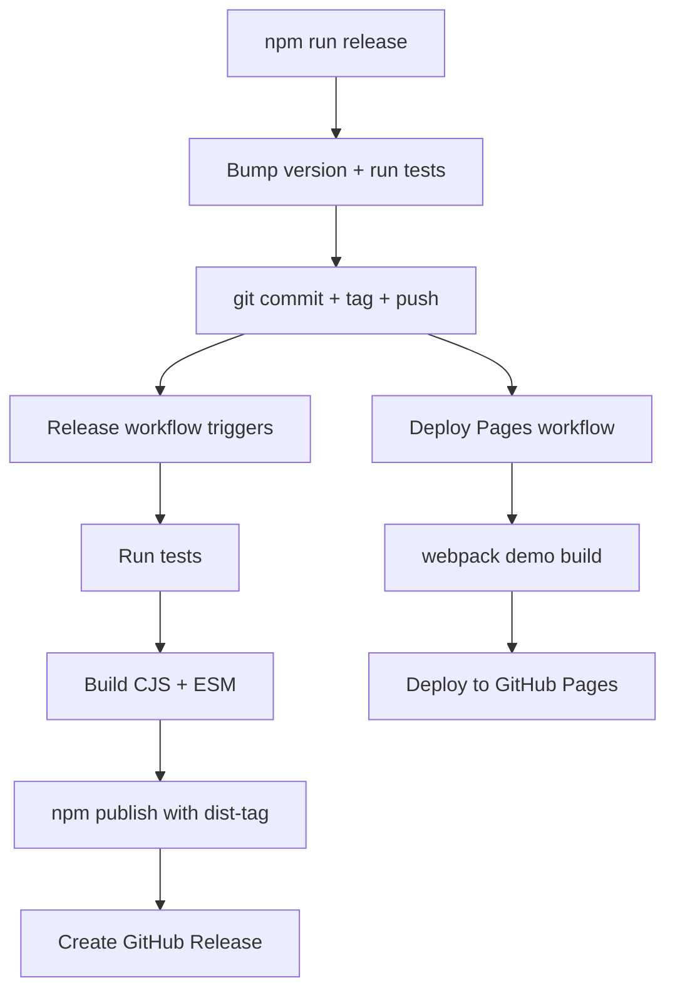
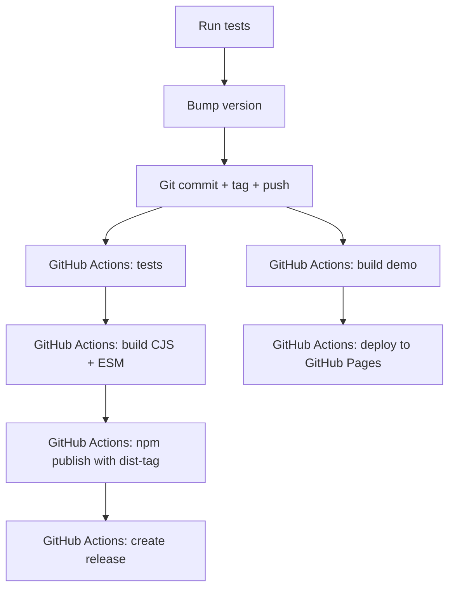

# @mdaushi/react-pivottable

> **Fork Notice:** This is a modernized fork of
> [react-pivottable](https://github.com/plotly/react-pivottable) by
> [Plotly](https://plot.ly). All credit for the original work goes to
> [Nicolas Kruchten](https://github.com/nicolaskruchten) and the Plotly team.

This fork modernizes the original library with updated build tooling (Babel 7,
Webpack 5, Jest 29, ESLint 8, Prettier 3), dual CJS + ESM output, built-in
TypeScript definitions, and React 16.8+ compatibility. It also adds additional
features on top of the original Table renderers.

See the [Hierarchical Grouping](#hierarchical-grouping-table-renderers)
section below for usage details.

## What does it do & where is the demo?

`react-pivottable`'s function is to enable data exploration and analysis by
summarizing a data set into table or [Plotly.js](https://plot.ly/javascript/)
chart with a true 2-d drag'n'drop UI, very similar to the one found in older
versions of Microsoft Excel.

A [live demo can be found here](https://mdaushi.github.io/react-pivottable/).


## How can I use it in my project?

### Drag'n'drop UI with Table output only

Installation is via NPM and has a peer dependency on React 16.8+:

```
npm install --save @mdaushi/react-pivottable react react-dom
```

The package ships **dual CJS + ESM output**. Modern bundlers (webpack 5, Vite,
Rollup, esbuild) automatically use the ESM version for tree-shaking. Node.js
and older bundlers fall back to CJS. You don't need to configure anything.

Basic usage is as follows. Note that `PivotTableUI` is a "dumb component" that
maintains essentially no state of its own.

```jsx
import React from 'react';
import {createRoot} from 'react-dom/client';
import PivotTableUI from '@mdaushi/react-pivottable';
import '@mdaushi/react-pivottable/pivottable.css';

// see documentation for supported input formats
const data = [
  ['attribute', 'attribute2'],
  ['value1', 'value2'],
];

class App extends React.Component {
  constructor(props) {
    super(props);
    this.state = props;
  }

  render() {
    return (
      <PivotTableUI
        data={data}
        onChange={(s) => this.setState(s)}
        {...this.state}
      />
    );
  }
}

createRoot(document.body).render(<App />);
```

> **Note:** The examples above use React 18's `createRoot` API. If you're on
> React 16 or 17, use `ReactDOM.render(<App />, document.body)` instead.

You can also import everything from the main entry point:

```js
import PivotTableUI, {
  PivotTable,
  TableRenderers,
  sortAs,
  PivotData,
  createPlotlyRenderers,
} from '@mdaushi/react-pivottable';
```

### With hierarchical grouping & subtotals

This fork adds `grouping`, `subtotals`, and `subtotalLabel` props that work
with the Table renderers:

```jsx
import PivotTableUI from '@mdaushi/react-pivottable';
import '@mdaushi/react-pivottable/pivottable.css';

const data = [
  ['Country', 'City', 'Sales'],
  ['USA', 'New York', 100],
  ['USA', 'Los Angeles', 200],
  ['Canada', 'Toronto', 150],
  ['Canada', 'Vancouver', 120],
];

class App extends React.Component {
  constructor(props) {
    super(props);
    this.state = props;
  }

  render() {
    return (
      <PivotTableUI
        data={data}
        rows={['Country', 'City']}
        aggregatorName="Sum"
        vals={['Sales']}
        grouping={true}
        subtotals={true}
        subtotalLabel={(value) => value + ' Total'}
        onChange={(s) => this.setState(s)}
        {...this.state}
      />
    );
  }
}
```

- `grouping={true}` enables collapsible parent/child hierarchy
- `subtotals={true}` adds subtotal rows after each expanded group
- `subtotalLabel` accepts a string or `(value, level, key) => string`

### Drag'n'drop UI with Plotly charts as well as Table output

The Plotly `react-plotly.js` component can be passed in via dependency
injection. It has a peer dependency on `plotly.js`.

**Important:** If you build your project using webpack, you'll have to follow
[these instructions](https://github.com/plotly/plotly.js#building-plotlyjs-with-webpack)
in order to successfully bundle `plotly.js`. See below for how to avoid having
to bundle `plotly.js`.

```
npm install --save @mdaushi/react-pivottable react-plotly.js plotly.js react react-dom
```

To add the Plotly renderers to your app, you can use the following pattern:

```jsx
import React from 'react';
import PivotTableUI from '@mdaushi/react-pivottable';
import {TableRenderers, createPlotlyRenderers} from '@mdaushi/react-pivottable';
import '@mdaushi/react-pivottable/pivottable.css';
import Plot from 'react-plotly.js';

// create Plotly renderers via dependency injection
const PlotlyRenderers = createPlotlyRenderers(Plot);

// see documentation for supported input formats
const data = [
  ['attribute', 'attribute2'],
  ['value1', 'value2'],
];

class App extends React.Component {
  constructor(props) {
    super(props);
    this.state = props;
  }

  render() {
    return (
      <PivotTableUI
        data={data}
        onChange={(s) => this.setState(s)}
        renderers={Object.assign({}, TableRenderers, PlotlyRenderers)}
        {...this.state}
      />
    );
  }
}
```

#### With external `plotly.js`

If you would rather not install and bundle `plotly.js` but rather get it into
your app via something like `<script>` tag, you can ignore `react-plotly.js`'
peer-dependcy warning and handle the dependency injection like this:

```jsx
import React from 'react';
import PivotTableUI from '@mdaushi/react-pivottable';
import {TableRenderers, createPlotlyRenderers} from '@mdaushi/react-pivottable';
import '@mdaushi/react-pivottable/pivottable.css';
import createPlotlyComponent from 'react-plotly.js/factory';

// create Plotly React component via dependency injection
const Plot = createPlotlyComponent(window.Plotly);

// create Plotly renderers via dependency injection
const PlotlyRenderers = createPlotlyRenderers(Plot);

const data = [
  ['attribute', 'attribute2'],
  ['value1', 'value2'],
];

class App extends React.Component {
  constructor(props) {
    super(props);
    this.state = props;
  }

  render() {
    return (
      <PivotTableUI
        data={data}
        onChange={(s) => this.setState(s)}
        renderers={Object.assign({}, TableRenderers, PlotlyRenderers)}
        {...this.state}
      />
    );
  }
}
```

### TypeScript support

This package ships with built-in type definitions. No need to install
`@types/@mdaushi/react-pivottable` separately.

```typescript
import React from 'react';
import PivotTableUI, {PivotTableUIProps} from '@mdaushi/react-pivottable';
import {TableRenderers} from '@mdaushi/react-pivottable';
import {PivotData, sortAs} from '@mdaushi/react-pivottable/Utilities';

const data: (string | number)[][] = [
    ['Country', 'City', 'Sales'],
    ['USA', 'New York', 100],
    ['USA', 'Los Angeles', 200],
];

class App extends React.Component<{}, Partial<PivotTableUIProps>> {
    state: Partial<PivotTableUIProps> = {
        data,
        rows: ['Country', 'City'],
        aggregatorName: 'Sum',
        vals: ['Sales'],
        grouping: true,
        subtotals: true,
        subtotalLabel: (value: string) => value + ' Total',
    };

    render() {
        return (
            <PivotTableUI
                {...this.state}
                onChange={s => this.setState(s)}
            />
        );
    }
}
```

Imported types can be used directly:

```typescript
import {
  PivotData,
  PivotDataProps,
  Data,
  Record as PivotRecord,
  Aggregator,
  SubtotalLabel,
} from '@mdaushi/react-pivottable/Utilities';

import {PivotTableUIProps, PivotTableProps} from '@mdaushi/react-pivottable';
```

## Properties and layered architecture

- `<PivotTableUI {...props} />`
  - `<PivotTable {...props} />`
    - `<Renderer {...props} />`
      - `PivotData(props)`

The interactive component provided by `@mdaushi/react-pivottable` is `PivotTableUI`, but
output rendering is delegated to the non-interactive `PivotTable` component,
which accepts a subset of its properties. `PivotTable` can be invoked directly
and is useful for outputting non-interactive saved snapshots of `PivotTableUI`
configurations. `PivotTable` in turn delegates to a specific renderer component,
such as the default `TableRenderer`, which accepts a subset of the same
properties. Finally, most renderers will create non-React `PivotData` object to
handle the actual computations, which also accepts a subset of the same props as
the rest of the stack.

Here is a table of the properties accepted by this stack, including an
indication of which layer consumes each, from the bottom up:

| Layer          | Key & Type                                       | Default Value                 | Description                                                                                                                                                                                                                                                                                                                                                                                                                                                                                                                                                                                                   |
| -------------- | ------------------------------------------------ | ----------------------------- | ------------------------------------------------------------------------------------------------------------------------------------------------------------------------------------------------------------------------------------------------------------------------------------------------------------------------------------------------------------------------------------------------------------------------------------------------------------------------------------------------------------------------------------------------------------------------------------------------------------- |
| `PivotData`    | `data` <br /> see below for formats              | (none, required)              | data to be summarized                                                                                                                                                                                                                                                                                                                                                                                                                                                                                                                                                                                         |
| `PivotData`    | `rows` <br /> array of strings                   | `[]`                          | attribute names to prepopulate in row area                                                                                                                                                                                                                                                                                                                                                                                                                                                                                                                                                                    |
| `PivotData`    | `cols` <br /> array of strings                   | `[]`                          | attribute names to prepopulate in cols area                                                                                                                                                                                                                                                                                                                                                                                                                                                                                                                                                                   |
| `PivotData`    | `vals` <br /> array of strings                   | `[]`                          | attribute names used as arguments to aggregator (gets passed to aggregator generating function)                                                                                                                                                                                                                                                                                                                                                                                                                                                                                                               |
| `PivotData`    | `aggregators` <br /> object of functions         | `aggregators` from `Utilites` | dictionary of generators for aggregation functions in dropdown (see [original PivotTable.js documentation](https://github.com/nicolaskruchten/pivottable/wiki/Aggregators))                                                                                                                                                                                                                                                                                                                                                                                                                                   |
| `PivotData`    | `aggregatorName` <br /> string                   | first key in `aggregators`    | key to `aggregators` object specifying the aggregator to use for computations                                                                                                                                                                                                                                                                                                                                                                                                                                                                                                                                 |
| `PivotData`    | `valueFilter` <br /> object of arrays of strings | `{}`                          | object whose keys are attribute names and values are objects of attribute value-boolean pairs which denote records to include or exclude from computation and rendering; used to prepopulate the filter menus that appear on double-click                                                                                                                                                                                                                                                                                                                                                                     |
| `PivotData`    | `sorters` <br /> object or function              | `{}`                          | accessed or called with an attribute name and can return a [function which can be used as an argument to `array.sort`](https://developer.mozilla.org/en/docs/Web/JavaScript/Reference/Global_Objects/Array/sort) for output purposes. If no function is returned, the default sorting mechanism is a built-in "natural sort" implementation. Useful for sorting attributes like month names, see [original PivotTable.js example 1](http://nicolas.kruchten.com/pivottable/examples/mps_agg.html) and [original PivotTable.js example 2](http://nicolas.kruchten.com/pivottable/examples/montreal_2014.html). |
| `PivotData`    | `rowOrder` <br /> string                         | `"key_a_to_z"`                | the order in which row data is provided to the renderer, must be one of `"key_a_to_z"`, `"value_a_to_z"`, `"value_z_to_a"`, ordering by value orders by row total                                                                                                                                                                                                                                                                                                                                                                                                                                             |
| `PivotData`    | `colOrder` <br /> string                         | `"key_a_to_z"`                | the order in which column data is provided to the renderer, must be one of `"key_a_to_z"`, `"value_a_to_z"`, `"value_z_to_a"`, ordering by value orders by column total                                                                                                                                                                                                                                                                                                                                                                                                                                       |
| `PivotData`    | `derivedAttributes` <br /> object of functions   | `{}`                          | defines derived attributes (see [original PivotTable.js documentation](https://github.com/nicolaskruchten/pivottable/wiki/Derived-Attributes))                                                                                                                                                                                                                                                                                                                                                                                                                                                                |
| `PivotData`    | `grouping` <br /> boolean                        | `false`                       | enables hierarchical expand/collapse grouping in the Table renderers. When `true`, parent row/column groups are collapsed by default and can be expanded by clicking the toggle icon.                                                                                                                                                                                                                                                                                                                                                                                                                         |
| `PivotData`    | `subtotals` <br /> boolean                       | `false`                       | when `true` (requires `grouping`), displays subtotal rows/columns after each expanded group's children. Subtotals show aggregated values computed across all children of that group.                                                                                                                                                                                                                                                                                                                                                                                                                          |
| `PivotData`    | `subtotalLabel` <br /> string or function        | `"Subtotal"`                  | label text for subtotal rows/columns. If a string, used as-is. If a function, called with `(value, level, key)` where `value` is the parent group value, `level` is the 0-indexed depth, and `key` is the full partial key array. e.g. `(value) => value + ' Total'` produces `"Thursday Total"`.                                                                                                                                                                                                                                                                                                             |
| `PivotData`    | `expandedRowGroups` <br /> object of booleans    | `{}`                          | tracks which row groups have been expanded. Keys are flat partial row keys. Managed automatically via `onChange` when `grouping` is enabled.                                                                                                                                                                                                                                                                                                                                                                                                                                                                  |
| `PivotData`    | `expandedColGroups` <br /> object of booleans    | `{}`                          | tracks which column groups have been expanded. Keys are flat partial column keys. Managed automatically via `onChange` when `grouping` is enabled.                                                                                                                                                                                                                                                                                                                                                                                                                                                            |
| `Renderer`     | `<any>`                                          | (none, optional)              | Renderers may accept any additional properties                                                                                                                                                                                                                                                                                                                                                                                                                                                                                                                                                                |
| `PivotTable`   | `renderers` <br /> object of functions           | `TableRenderers`              | dictionary of renderer components                                                                                                                                                                                                                                                                                                                                                                                                                                                                                                                                                                             |
| `PivotTable`   | `rendererName` <br /> string                     | first key in `renderers`      | key to `renderers` object specifying the renderer to use                                                                                                                                                                                                                                                                                                                                                                                                                                                                                                                                                      |
| `PivotTableUI` | `onChange` <br /> function                       | (none, required)              | function called every time anything changes in the UI, with the new value of the properties needed to render the new state. This function must be hooked into a state-management system in order for the "dumb" `PivotTableUI` component to work.                                                                                                                                                                                                                                                                                                                                                             |
| `PivotTableUI` | `hiddenAttributes` <br /> array of strings       | `[]`                          | contains attribute names to omit from the UI                                                                                                                                                                                                                                                                                                                                                                                                                                                                                                                                                                  |
| `PivotTableUI` | `hiddenFromAggregators` <br /> array of strings  | `[]`                          | contains attribute names to omit from the aggregator arguments dropdowns                                                                                                                                                                                                                                                                                                                                                                                                                                                                                                                                      |
| `PivotTableUI` | `hiddenFromDragDrop` <br /> array of strings     | `[]`                          | contains attribute names to omit from the drag'n'drop portion of the UI                                                                                                                                                                                                                                                                                                                                                                                                                                                                                                                                       |
| `PivotTableUI` | `menuLimit` <br /> integer                       | 500                           | maximum number of values to list in the double-click menu                                                                                                                                                                                                                                                                                                                                                                                                                                                                                                                                                     |
| `PivotTableUI` | `unusedOrientationCutoff` <br /> integer         | 85                            | If the attributes' names' combined length in characters exceeds this value then the unused attributes area will be shown vertically to the left of the UI instead of horizontally above it. `0` therefore means 'always vertical', and `Infinity` means 'always horizontal'.                                                                                                                                                                                                                                                                                                                                  |

### Hierarchical Grouping (Table Renderers)

When `grouping` is set to `true`, the Table renderers display parent row/column
groups in a collapsible hierarchy. Groups are **collapsed by default** — the
user clicks the ▶ icon to expand a group and ▼ to collapse it. This is useful
when multiple attributes are placed on the same axis (e.g. `Country` → `City`),
producing a deep table that can be interactively expanded and collapsed.

Collapsed groups show aggregated values computed across all their children.
The expand/collapse state is managed via `expandedRowGroups` /
`expandedColGroups` and flows through `onChange` like all other `PivotTableUI`
state, so it persists across re-renders.

Axis-label headers also have a ▶/▼ toggle that expands or collapses **all** groups
at that level at once.

#### Subtotals

When `subtotals` is set to `true` (along with `grouping`), a **Subtotal** row
(or column) is inserted after the last child of each expanded group, showing
the aggregated value across all children of that group. Collapsed groups do
not get subtotals since their summary already shows the aggregated value.

By default the subtotal label is the string `"Subtotal"`. You can customize
it with the `subtotalLabel` prop — either a static string or a function that
receives `(value, level, key)` and returns a dynamic label:

```js
<PivotTableUI
  data={data}
  onChange={(s) => this.setState(s)}
  grouping={true}
  subtotals={true}
  subtotalLabel={(value) => value + ' Total'}
  {...this.state}
/>
```

With the above, a subtotal under `Thursday` would show `"Thursday Total"`
instead of `"Subtotal"`.

**Note:** This feature is currently supported only by the Table renderers
(`Table`, `Table Heatmap`, `Table Row Heatmap`, `Table Col Heatmap`).

### Accepted formats for `data`

#### Arrays of objects

One object per record, the object's keys are the attribute names.

_Note_: missing attributes or attributes with a value of `null` are treated as
if the value was the string `"null"`.

```js
const data = [
  {
    attr1: 'value1_attr1',
    attr2: 'value1_attr2',
    //...
  },
  {
    attr1: 'value2_attr1',
    attr2: 'value2_attr2',
    //...
  },
  //...
];
```

#### Arrays of arrays

One sub-array per record, the first sub-array contains the attribute names. If
subsequent sub-arrays are shorter than the first one, the trailing values are
treated as if they contained the string value `"null"`. If subsequent sub-arrays
are longer than the first one, excess values are ignored. This format is
compatible with the output of CSV parsing libraries like PapaParse.

```js
const data = [
  ['attr1', 'attr2'],
  ['value1_attr1', 'value1_attr2'],
  ['value2_attr1', 'value2_attr2'],
  //...
];
```

#### Functions that call back

The function will be called with a callback that takes an object as a parameter.

_Note_: missing attributes or attributes with a value of `null` are treated as
if the value was the string `"null"`.

```js
const data = function(callback) {
    callback({
        "attr1": "value1_attr1",
        "attr2": "value1_attr2",
        //...
    });
    callback({
        "attr1": "value2_attr1",
        "attr2": "value2_attr2",
        //...
    };
    //...
};
```

## Publishing & Releasing

Releases are handled by **GitHub Actions** — the local script only bumps the
version and pushes a tag, then CI does the rest (tests, build, npm publish,
GitHub Release, Pages deploy).

### GitHub Actions workflows

| Workflow         | Trigger             | What it does                                                            |
| ---------------- | ------------------- | ----------------------------------------------------------------------- |
| **CI**           | push/PR to `master` | ESLint, Prettier, Jest, `tsc`, and build on Node 18/20/22               |
| **Release**      | push tag `v*`       | Tests, builds, publishes to npm (with dist-tag), creates GitHub Release |
| **Deploy Pages** | push to `master`    | Builds demo with webpack, deploys to GitHub Pages                       |

#### One-time setup

1. **npm token** — Create an access token at
   https://www.npmjs.com/settings/\<username\>/tokens (type: **Automation**)
2. **Add secret** — Go to repo Settings > Secrets and variables > Actions >
   New repository secret:
   - Name: `NPM_TOKEN`
   - Value: your npm token
3. **Pages config** — Go to repo Settings > Pages > Source: **GitHub Actions**

#### How to release

The `npm run release` command bumps the version, runs tests, commits, tags,
and pushes. GitHub Actions then takes over:



After release, the demo is live at:
`https://mdaushi.github.io/react-pivottable/`

### Release commands

| Command                | Version becomes        | npm dist-tag | Who installs it     |
| ---------------------- | ---------------------- | ------------ | ------------------- |
| `npm run release`      | `0.12.2` (interactive) | `latest`     | All users (default) |
| `npm run release:dev`  | `0.12.2-dev.0`         | `dev`        | Early testers       |
| `npm run release:beta` | `0.12.2-beta.0`        | `beta`       | Beta testers        |
| `npm run release:rc`   | `0.12.2-rc.0`          | `rc`         | Release candidates  |

Users install a specific channel:

```sh
# Stable (default)
npm install @mdaushi/react-pivottable

# Dev channel — latest development build
npm install @mdaushi/react-pivottable@dev

# Beta channel
npm install @mdaushi/react-pivottable@beta

# Release candidate
npm install @mdaushi/react-pivottable@rc
```

Pre-release versions do **not** replace `latest` — users who don't specify a
tag always get the stable version.

#### Pre-release flow example

```sh
# 1. Publish a dev build for early testing
npm run release:dev    # → v0.12.2-dev.0, tag: dev

# 2. Fix issues, publish another dev build
npm run release:dev    # → v0.12.2-dev.1, tag: dev

# 3. Stabilize, publish beta for broader feedback
npm run release:beta   # → v0.12.2-beta.0, tag: beta

# 4. Ready for stable release
npm run release        # → v0.12.2, tag: latest
```

### Direct script usage

You can also call the script directly with specific bump types:

```sh
./scripts/publish.sh patch      # 0.12.1 → 0.12.2
./scripts/publish.sh minor      # 0.12.1 → 0.13.0
./scripts/publish.sh major      # 0.12.1 → 1.0.0
./scripts/publish.sh 1.2.3      # specific version
./scripts/publish.sh dev        # 0.12.2-dev.0 (dist-tag: dev)
./scripts/publish.sh beta       # 0.12.2-beta.0 (dist-tag: beta)
./scripts/publish.sh rc         # 0.12.2-rc.0 (dist-tag: rc)
```

### Prerequisites

- **npm**: must be logged in (`npm login`)
- **Git tree**: must be clean (no uncommitted changes)
- **NPM_TOKEN secret**: set in GitHub repo Settings > Secrets

### What happens step by step



After publishing, the demo will be available at:
`https://mdaushi.github.io/react-pivottable/`
